<strong>▮ REPO ARCHIVE</strong> — every repo, by year (click for links + topics)

<!-- REPO_LIST_START -->

<strong>2026</strong> — 20 repos

- [**mochi-llm-pet**](https://github.com/NatBrian/mochi-llm-pet) — Mochi is a transparent AI desktop companion powered by multimodal LLMs. It understands your screen, windows, active apps, and cursor, then reacts in character walking, watching, sleeping, sulking, and building long-term memories that shape its evolving personality. • `Python` • ★ 5 • 🍴 0 • Topics: ai-pet, dekstop-ai, llm, pet, pet-project, virtual-pet, virtualpet
- [**image-token-compression**](https://github.com/NatBrian/image-token-compression) — LLM token compression via images: a transparent Antrhopic/OpenAI proxy that renders agent context (system prompt, tool docs, tool output, history) to pixels, so coding-agent CLIs like OpenCode send far fewer input tokens. Keeps tool calls and multi-turn intact. ~39% fewer tokens on real runs. • `Python` • ★ 2 • 🍴 0 • Topics: agentic-ai, claude-code, codex, context-compression, llm, openai-compatible, opencode, opencode-plugin, prompt-compression, proxy, token-compression, token-optimization, vision-language-model
- [**llm-vs-house**](https://github.com/NatBrian/llm-vs-house) — Can LLMs beat pure luck? Benchmark AI against mathematically unwinnable casino games through real reproducible experiments. Evaluate reasoning under randomness with ROI analysis, bankroll dynamics, statistical significance testing, expected value, house edge, and long-run outcome distributions. • `JavaScript` • ★ 1 • 🍴 0 • Topics: baccarat, benchmark, casino, game, llm, random, roulette, roulette-game, sicbo, slot-machine, slots
- [**LLMTradingAgents**](https://github.com/NatBrian/LLMTradingAgents) — LLMTradingAgents is an automated trading system that orchestrates competition between different Large Language Models (LLMs). It uses a 3-agent architecture to analyze market data, propose trades, and validate risk. • `Python` • ★ 1 • 🍴 0 • Topics: ai-agents, cryptocurrency, finance, langchain, llm, marketing-analytics, stock, trading, trading-algorithms, vite
- [**nashville-traffic-stop-bias-analysis**](https://github.com/NatBrian/nashville-traffic-stop-bias-analysis) — End-to-end analysis of racial bias in Nashville Police Department traffic stops using interpretable machine learning, statistical tests, and fairness audits • `Jupyter Notebook` • ★ 1 • 🍴 0
- [**artist-popularity-m3u8-playlist-generator**](https://github.com/NatBrian/artist-popularity-m3u8-playlist-generator) — Pipeline that builds two 1500-track M3U8 playlists (popularity-first + deep cuts) from an ordered artist taxonomy. Aggregates iTunes & Deezer data, ranks tracks, enforces zero-overlap, validates structure, and supports precise per-artist quota control via CSV with priority-based allocation logic • `Python` • ★ 0 • 🍴 0 • Topics: deezer, itunes, m3u8, m3u8-playlist, music, playlist, song, youtube, youtube-music, youtube-playlist
- [**auto-research-finance**](https://github.com/NatBrian/auto-research-finance) — Autonomous, auditable quantitative finance agents orchestrated via Claude Code. Implements MCP-based tooling, multi-agent trading debates, arXiv-to-factor pipelines for reproducible financial research, and comprehensive financial report. • `Python` • ★ 0 • 🍴 1
- [**chrome-llm-automation**](https://github.com/NatBrian/chrome-llm-automation) — Chrome Extension for agentic browser automation. Runs entirely in the Side Panel using Set-of-Marks (SoM) grounding for reliable, high-precision observation and action. Powered by LLMs your choice. • `TypeScript` • ★ 0 • 🍴 0
- [**chronica**](https://github.com/NatBrian/chronica) — World sim that thinks: LLM-powered kings scheme, war, and write history across 500 years on a fantasy island. Click any chronicle paragraph to travel back and watch it unfold. Observer only, zero backend, in your browser. Enjoy the full experience. • `TypeScript` • ★ 0 • 🍴 0 • Topics: canvas2d, fantasy, game, llm, ollama, procedural-generation, simulation, typescript, vite, world-simulation
- [**compiled-wiki-lifecycle**](https://github.com/NatBrian/compiled-wiki-lifecycle) — Paper + experiments: compiled-wiki lifecycle with 4 stages (compile, certify, maintain, retract) for LLM-compiled wikis, providing certified correctness guarantees over evolving corpora. Includes minimal llm-wiki implementation. • `Python` • ★ 0 • 🍴 0 • Topics: karpathy-llm-wiki, knowledge-base, knowledge-compilation, large-language-models, llm, llm-wiki, machine-unlearning, nlp, not-peer-reviewed, preprint, rag, reproducible-research, research-paper, retrieval-augmented-generation, statistical-certification, wiki
- [**dns-whitelist**](https://github.com/NatBrian/dns-whitelist) • `Unknown` • ★ 0 • 🍴 0
- [**Dyslexia-Web-Reader**](https://github.com/NatBrian/Dyslexia-Web-Reader) — Help dyslexia struggle via Chrome Extension (Manifest V3) that converts web articles into a distraction-free reader view with adjustable typography, guided reading, text-to-speech, and optional LLM-powered simplification. • `TypeScript` • ★ 0 • 🍴 1
- [**HT-VideoGraph**](https://github.com/NatBrian/HT-VideoGraph) — HT-VideoGraph is the first Hierarchical Temporal Knowledge Graph (HTKG) for long video understanding. It addresses the fundamental limitations of current video RAG methods by modeling videos at multiple temporal granularities with multi-modal feature preservation. • `Python` • ★ 0 • 🍴 0
- [**medical-record-rag**](https://github.com/NatBrian/medical-record-rag) — Privacy-first medical AI. Quote-gated RAG transforms scattered medical records (lab reports and clinic notes) into a searchable longitudinal health history with verifiable citations, semantic search, deterministic extraction, hybrid SQL+RAG retrieval, and local-first architecture. • `TypeScript` • ★ 0 • 🍴 0 • Topics: cloudflare, embeddings, healthcare-ai, llm, medical-rag, rag, rag-pipeline, workers-ai
- [**nbme-qlora-ensemble**](https://github.com/NatBrian/nbme-qlora-ensemble) — Generative SLM Ensemble for NBME Clinical Span Extraction (0.732 F1). Novel 3-phase pipeline: (1) RAG-guided Qwen3-8B pseudo-labeling, (2) Sequential QLoRA fine-tuning of 4 diverse SLMs, (3) FSM-constrained inference + char-level voting. Outperforms baselines by +0.222 F1. Includes adapters, vLLM optimization for 2xT4, and full ablation code. • `Jupyter Notebook` • ★ 0 • 🍴 0 • Topics: faiss, jupyter-notebook, kaggle, kaggle-competition, llm, lora, nbme, peft-fine-tuning-llm, rag
- [**program-as-weights-github**](https://github.com/NatBrian/program-as-weights-github) — Program-as-Weights, reimplemented: compile an English fuzzy-function spec once into a tiny LoRA+pseudo-program a frozen 0.6B model runs offline. Applied to real GitHub issues/PRs. • `Python` • ★ 0 • 🍴 1
- [**secure-enterprise-rag**](https://github.com/NatBrian/secure-enterprise-rag) — RAG over heterogeneous enterprise data (PDFs, CSV, JSON logs, reports) with role-based access control enforced inside retrieval, forbidden chunks never reach the ranker, reranker, prompt, or LLM. Hybrid BM25+dense+rerank, grounded citations, sanitised refusals, audit log. • `Python` • ★ 0 • 🍴 0
- [**sudoku-llm-arena**](https://github.com/NatBrian/sudoku-llm-arena) — Train & Benchmarks LLM Sudoku solving on Sakana AI's Sudoku-Bench with multi-step & single-shot evaluation, animated solve visualizations, model comparisons, reports, and LoRA/GRPO post-training experiments to measure how far small local models can close the gap to frontier models. • `Python` • ★ 0 • 🍴 0 • Topics: fine-tuning, finetuning, gpro, lora, small-llm, sudoku, sudoku-solver
- [**tokengotchi**](https://github.com/NatBrian/tokengotchi) — Tamagotchi for your AI coding terminal: a context-aware virtual pet companion that feeds on LLM tokens and evolves. Tokengotchi watches Claude Code, Codex, Gemini CLI, Qwen, opencode, growing pixel-art creatures (terminal + statusline) that match what you're coding, moods & levels. • `Python` • ★ 0 • 🍴 0 • Topics: buddy, claude-code, code-companion, codex, companion, gemini, opencode, pet, qwen, tamagotchi, terminal, terminal-pet, virtual-pet
- [**whatsapp-ai-recall**](https://github.com/NatBrian/whatsapp-ai-recall) — WAIR: A privacy-first, local-only AI assistant for WhatsApp. Indexes chat history into an encrypted SQLite database using hybrid RAG (vector + full-text) and local LLMs (Ollama). Zero data leaves your machine. • `TypeScript` • ★ 0 • 🍴 0

<strong>2025</strong> — 13 repos

- [**wildlife-camera-trap-ai-system**](https://github.com/NatBrian/wildlife-camera-trap-ai-system) — AI-powered wildlife monitoring system powered by YOLOv8, with real-time detection and automatic video recording on the edge device. Metadata and thumbnails sync to a web dashboard for easy browsing and filtering. • `Jupyter Notebook` • ★ 1 • 🍴 0 • Topics: ai, animal, bird, camera, computer-vision, edge, onnx, wildlife, yolo
- [**AeroFighters-SNES-reinforce-learning**](https://github.com/NatBrian/AeroFighters-SNES-reinforce-learning) — Reinforce Learning AeroFighter Snes game using Gym Retro • `Python` • ★ 0 • 🍴 0 • Topics: arcade, dqn, game, gym, ppo, reinforcement-learning, retro, snes
- [**AgenticReqToDesign**](https://github.com/NatBrian/AgenticReqToDesign) — Agentic AI transforming Business Requirements into Technical Detailed Design • `HTML` • ★ 0 • 🍴 0 • Topics: agentic-ai, ai, artificial-intelligence, autogen, gemini
- [**bullet-hell-100kbbh-rl**](https://github.com/NatBrian/bullet-hell-100kbbh-rl) — Gymnasium env + DQN/Double-DQN to dodge bullets in 100KBBH. Live preview, video recording, TensorBoard, CSV logs, and HTML reports. • `Python` • ★ 0 • 🍴 0 • Topics: bullet-hell, dqn, game, pytorch, reinfocement-learning
- [**CanvasAI**](https://github.com/NatBrian/CanvasAI) — Interactive 2D game development sandbox that allows you to create and modify games using the power of Google's Gemini AI • `TypeScript` • ★ 0 • 🍴 0 • Topics: 2d-game, ai, artificial-intelligence, game, game-development, gemini
- [**chatgpt-from-scratch**](https://github.com/NatBrian/chatgpt-from-scratch) — A comprehensive, zero-dependency notebook to build a modern GPT from scratch. Implements Llama 3 architecture (RMSNorm, RoPE, SwiGLU) and trains on FineWeb-Edu using PyTorch. Educational, clean, and hackable. • `Jupyter Notebook` • ★ 0 • 🍴 0 • Topics: bigram, chatgpt, colab-notebook, llama3, llm, notebook, tokenization, transformer
- [**gemini-chess**](https://github.com/NatBrian/gemini-chess) — A minimalist chess simulator powered by Google Gemini. This project uses the Gemini API to evaluate board states and generate moves via FEN strings. Featuring legal move validation, it provides a clean environment for testing LLM strategic reasoning and spatial awareness in a classic game setting. • `TypeScript` • ★ 0 • 🍴 0 • Topics: gemini, generative-ai, llm
- [**interactive-mcq-trainer**](https://github.com/NatBrian/interactive-mcq-trainer) — A simple, elegant MCQ practice UI built with pure HTML, CSS, and JavaScript.  Auto-detects single/multiple answers and highlights correctness instantly.  Includes explanations, scoring summary, and review mode. • `JavaScript` • ★ 0 • 🍴 0 • Topics: exam, mcq, mcq-test, multiple-choice, notebooklm, quiz, test
- [**mediapipe-hand-recognition**](https://github.com/NatBrian/mediapipe-hand-recognition) — Hand recognition system using MediaPipe for real-time hand tracking, static hand-sign classification, dynamic movement classification, and data collection for training custom ML models. • `Jupyter Notebook` • ★ 0 • 🍴 2 • Topics: handgesture-recognition, machine-learning, mediapipe, ml, supervised-learning
- [**mini-rl-zoo**](https://github.com/NatBrian/mini-rl-zoo) — Educational RL framework with Q-learning, SARSA, DQN, A2C, and PPO implementations. Features multi-seed experimentation, automated analytics, and visualization for algorithm comparison. • `Python` • ★ 0 • 🍴 0 • Topics: cartpole, dqn, frozenlake, lunar-lander, pusher, q-learning, reinforcement-learning
- [**pong-ai**](https://github.com/NatBrian/pong-ai) — A modern arcade classic fused with generative AI. Battle a digital opponent as Google Gemini (via Genkit) dynamically mutates the game after every point you score. Experience unpredictable shifts in gravity, physics, and scale in real-time. Where retro gameplay meets alchemical AI transformation. • `TypeScript` • ★ 0 • 🍴 0 • Topics: arcade, gemini, generative-ai, llm, pong
- [**T-ECD-Sequential-Recommender**](https://github.com/NatBrian/T-ECD-Sequential-Recommender) — Sequential Recommender (SASRec/GRU) benchmarking the T-ECD dataset (9.2M events). Features interactive testing dashboards, 2D/3D cross-domain embedding visualizations, and impact analysis. • `Jupyter Notebook` • ★ 0 • 🍴 0 • Topics: embeddings, gru, gru4rec, notebook, pytorch, recommendation-system, recommender-system, rnn, sasrec, transformer
- [**web-image-gallery**](https://github.com/NatBrian/web-image-gallery) — A lightweight web application to extract all image URLs from a given website and display them in a dynamic, responsive gallery with infinite scrolling • `JavaScript` • ★ 0 • 🍴 0

<strong>2024</strong> — 3 repos

- [**ChatGPT-custom-instruction**](https://github.com/NatBrian/ChatGPT-custom-instruction) — personal experiments on ChatGPT custom instruction • `Unknown` • ★ 2 • 🍴 0
- [**GeminiChatFile**](https://github.com/NatBrian/GeminiChatFile) — Chat File with Gemini • `Python` • ★ 1 • 🍴 9 • Topics: gemini, gemini-pro, llm
- [**PollinationAI**](https://github.com/NatBrian/PollinationAI) — AI Image Generation https://pollinationsai.netlify.app/ • `Unknown` • ★ 1 • 🍴 0

<strong>2023</strong> — 5 repos

- [**NewsFront**](https://github.com/NatBrian/NewsFront) — Classic News WebApp • `JavaScript` • ★ 2 • 🍴 0 • Topics: news, newsapi, newsapp
- [**NatBrian**](https://github.com/NatBrian/NatBrian) • `Unknown` • ★ 0 • 🍴 0
- [**scrollscape**](https://github.com/NatBrian/scrollscape) — Endless Photos Scrolling • `JavaScript` • ★ 0 • 🍴 0
- [**trading-simulation**](https://github.com/NatBrian/trading-simulation) — A high-throughput trading simulation for calculating OHLC summaries from large transaction volumes. Built with a Go app server, it leverages Kafka for asynchronous message queuing and Redis for fast data persistence. Features include Protobuf for data serialization, Dockerized infrastructure, and an API for bulk transaction. • `Go` • ★ 0 • 🍴 0
- [**whatsapp-chatgpt**](https://github.com/NatBrian/whatsapp-chatgpt) • `Python` • ★ 0 • 🍴 0

<strong>2022</strong> — 1 repos

- [**DecoratorDesignPattern**](https://github.com/NatBrian/DecoratorDesignPattern) — Example of Decorator Design Pattern In Go • `Go` • ★ 0 • 🍴 0

<strong>2021</strong> — 1 repos

- [**Python-For-Data-Science-Essential-Training-Part-1**](https://github.com/NatBrian/Python-For-Data-Science-Essential-Training-Part-1) — Linkedin Learning https://www.linkedin.com/learning/python-for-data-science-essential-training-part-1 • `Jupyter Notebook` • ★ 0 • 🍴 0

<strong>2020</strong> — 7 repos

- [**campus_indoor_map**](https://github.com/NatBrian/campus_indoor_map) — Interactive University of Maryland campus indoor map with mapbox and openstreetmap • `JavaScript` • ★ 0 • 🍴 0 • Topics: mapbox, openstreetmap
- [**EM-algorithm-implementation**](https://github.com/NatBrian/EM-algorithm-implementation) — Implement Expectation-Maximization algorithm • `Jupyter Notebook` • ★ 0 • 🍴 0
- [**GameSalad**](https://github.com/NatBrian/GameSalad) — Spanish Grammar Racing Game • `Unknown` • ★ 0 • 🍴 0 • Topics: game
- [**Github-IO-Template-academicpages**](https://github.com/NatBrian/Github-IO-Template-academicpages) — Nathanael Brian Github Page • `JavaScript` • ★ 0 • 🍴 0
- [**SG-Data-Structure**](https://github.com/NatBrian/SG-Data-Structure) — Snippet code of S-G-Tree and S-G-KD-Tree data structure • `Java` • ★ 0 • 🍴 0
- [**TwoHatsGame**](https://github.com/NatBrian/TwoHatsGame) — Simulation game, where the user set up a hat color for each of the two people, either Blue or Red. If at least one of the two is right, they both win. They are allowed to come up with a plan in advance, but the adversary who is deciding which hats to put on them will hear the plan and will actively work against it. • `Java` • ★ 0 • 🍴 0
- [**VideoPlayer**](https://github.com/NatBrian/VideoPlayer) — Video player with extra features, such as time stamp labeling • `JavaScript` • ★ 0 • 🍴 0

<strong>2019</strong> — 2 repos

- [**Data-Science-Tutorial**](https://github.com/NatBrian/Data-Science-Tutorial) — Data Science pipeline tutorial • `HTML` • ★ 0 • 🍴 0
- [**JapaneseTranslationDiagflow**](https://github.com/NatBrian/JapaneseTranslationDiagflow) — Japanese Translation Chat Bot (with voice recorder). Translation hasn't been implemented yet. • `Java` • ★ 0 • 🍴 0

_Last updated: 2026-08-24T00:42:42.632Z_

<!-- REPO_LIST_END -->

&nbsp;

  <a href="https://www.linkedin.com/in/nathanael-brian-b47a73165/">linkedin</a> · <a href="https://github.com/NatBrian">github</a>
  &nbsp;·&nbsp; uplink 2026-05-09

